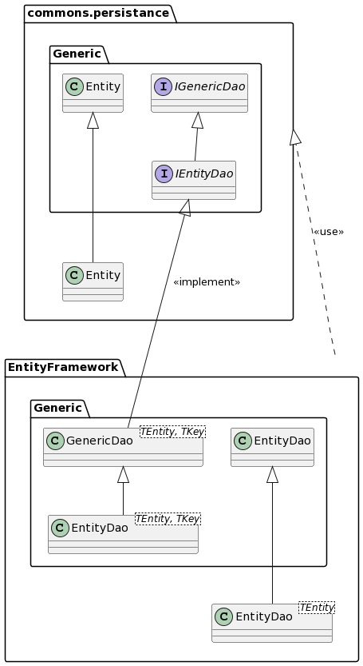

= csharp-commons.persistence

== Description
To be able to query or change data persistently in a database, for example. 

== class diagramm 

== Example
We want to use commons.persistance to get the number and a list of all movies contained in a given database. +
Steps:

* register the Dao
[source, C#]
....
builder.Services.AddScoped<IGenericDao<Movie, int>, MovieDao>();
....

* create a new class to be able to implement the dao
[source, C#]
....
public class MovieDao : GenericDao<Movie, int>
    {
        public MovieDao(MvcMovieContext dbContext) : base(dbContext)
        {
        }
    }
....
* instantiate new Dao in the controller class with an integer as Id
[source, C#]
....
private readonly IGenericDao<Movie, int> _movieDao;
....
* add the dao to the constructor of the controller
[source, C#]
....
public MoviesController(IGenericDao<Movie, int> movieDao)
{
    _movieDao = movieDao;
}
....

* Determine the number of films with the help of the Daos
[source, C#]
....
public long AnzahlDerFilme()
{
    _movieDao.GetAll(); // gibt eine Liste von Entitäten zurück
    return _movieDao.GetCount(); //gibt die anzahl der Entitäten zurück
}
....

== How to use it
* include Nuget-Package (queo.commons.persistance)
[source, ps]
....
Find-Package queo.commons.persistance 
Install-Package queo.commons.persistance -ProjectName MyProject
....
* register the Dao
* create a new class to be able to implement the dao
* instantiate new Dao in the controller class
* add the dao to the constructor of the controller
* now you can use the Dao
