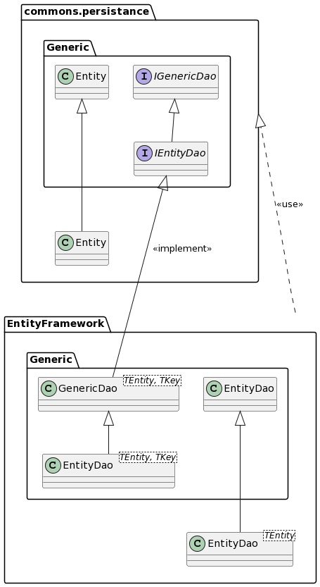

# Commons.Persistence

[](https://dev.azure.com/queo-commons/Commons-OpenSource/_build/latest?definitionId=4&branchName=main) [](https://dev.azure.com/queo-commons/Commons-OpenSource/_build/latest?definitionId=4&branchName=develop)

## Description
To be able to query or change data persistently in a database, for example. 

## Class diagramm 


## Example
We want to use commons.persistance to get the number and a list of all movies contained in a given database.

### Steps:

- Register dao with e.g. [Microsoft.Extensions.DependencyInjection](https://docs.microsoft.com/de-de/dotnet/api/microsoft.extensions.dependencyinjection?view=dotnet-plat-ext-6.0) or simply create an instance like:
  
```csharp
IGenericDao<Movie, int> _movieDao = new MovieDao<Movie, int>();
```

- Create a new class to be able to implement the dao

```csharp
public class MovieDao : GenericDao<Movie, int>
{
    public MovieDao(MovieContext dbContext) : base(dbContext)
    {
    }
}
```

- Now you can use the dao to get all the data

```csharp
IEnumerable allMovies = movieDao.GetAll();
```

- Determine the number of films with the help of the Daos

```csharp
public long AnzahlDerFilme()
{
    return allMovies.GetCount(); //returns amount of entities
}
```

## How to use it
- include Nuget-Package (queo.commons.persistance)

```csharp
<PackageReference Include="Queo.Commons.Persistence" Version="3.0.0" />
```

- Register the Dao
- Create a new class to be able to implement the dao
- Instantiate new Dao 
- Now you can use the Dao
- If you want to use the TransactionHandling, you have to call the method "UseTransactionHandling <TDbContext>(this IServiceCollection services)" from the TransactionHandlingExtensions class inside your program.cs or startup.cs.